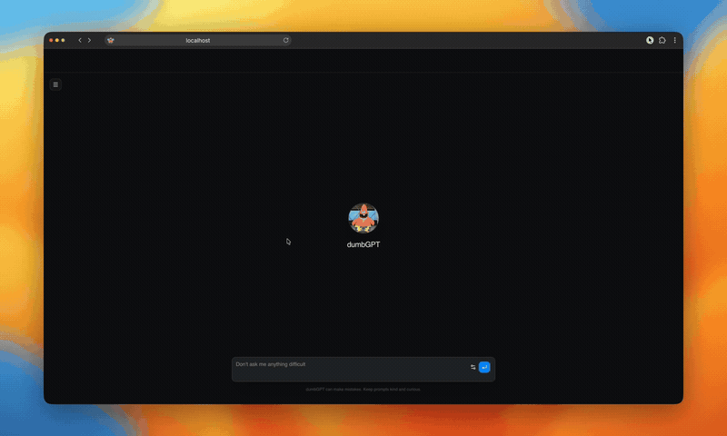
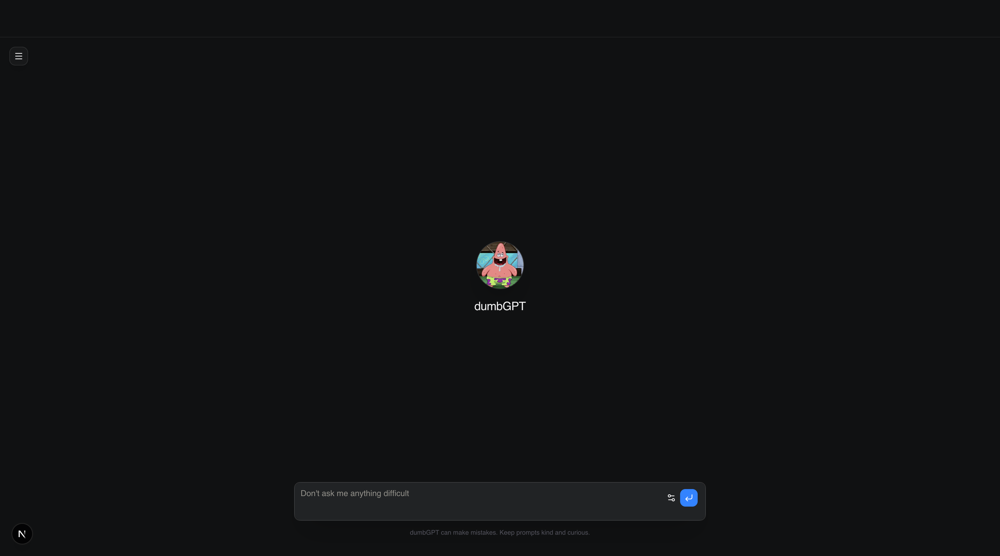
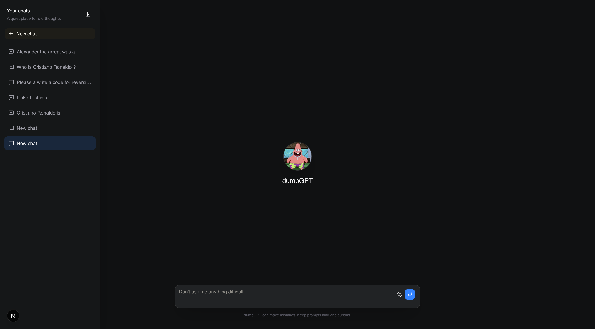
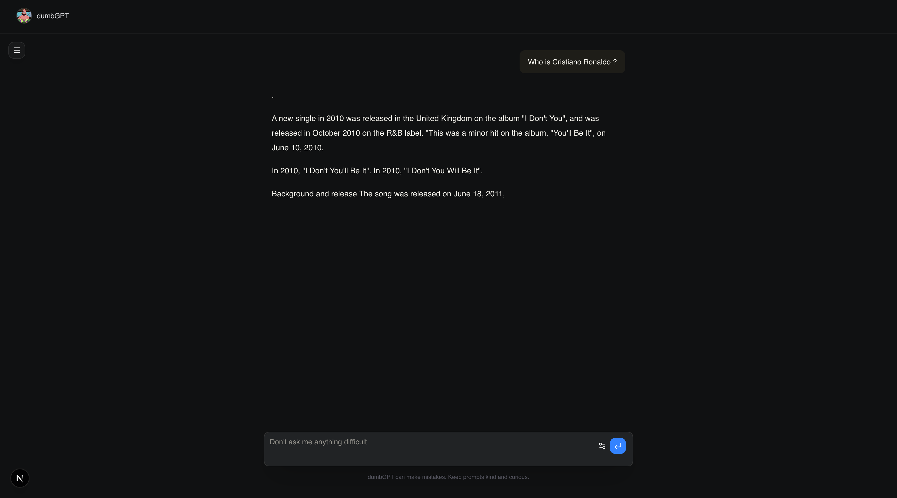

# 🧠 microGPT (dumbGPT)

> A Decoder-Only Language Model built from scratch — from raw Wikipedia text processing and custom Byte-Pair Encoding (BPE) tokenization, to Transformer architecture design, training on Google Colab, and deployment with a FastAPI backend & Next.js frontend UI.

---

## 🎬 Demo Video Preview



### Interface Screenshots

| Homepage | Sidebar & Chat History | Active Chat |
| :---: | :---: | :---: |
|  |  |  |

---

## 🔍 Why is the Model Performing Poorly? (Technical Post-Mortem)

The name **dumbGPT** / **microGPT** is fitting for a reason. During testing, the model outputs grammatically loose or repetitive text. Here is a breakdown of why:

### 1. Parameter Scale (~22.2M Parameters)
- **Total Parameters:** `22,265,856` (~22M parameters).
- **Comparison:**
  - `GPT-2 Small`: **124M** parameters (over 5.5× larger).
  - `LLaMA-3 8B`: **8,000M** parameters (over 360× larger).
  - `GPT-3`: **175,000M** parameters (over 7,800× larger).
- **Impact:** A 22M parameter model has a tiny capacity to store facts, grammar nuances, and high-level reasoning. It can learn local syntax and character/word transitions, but struggles with long-range coherence and factual knowledge.

### 2. Under-Training & Convergence Status
- **Training Iterations:** `16,500` steps.
- **Batch Size & Context:** Batch size = `32`, Sequence length (`block_size`) = `256` tokens.
- **Tokens Seen:** $16,500 \times 32 \times 256 \approx 135\text{ Million tokens}$.
- **Loss Progression:**
  - Initial Loss (Step 0): `~10.40`
  - Step 1,000: `~5.85`
  - Step 5,000: `~4.68`
  - Final Loss (Step 16,500): `~4.0137`
- **Perplexity:** Cross-entropy loss of `4.0137` translates to a perplexity of:
  $$\text{PPL} = e^{4.0137} \approx 55.35$$
  For comparison, well-converged models achieve cross-entropy loss $< 2.5$ (Perplexity $< 12$). At $\sim 4.01$, the model is still in the early stages of language acquisition.

### 3. Base Pretraining vs. Instruction Fine-Tuning
- **Pretraining Dataset:** Raw English Wikipedia (`wikimedia/wikipedia`).
- **Nature of Model:** This is a raw next-token predictor (completion model), not a chatbot. When prompted with a conversational question (e.g. *"What is the capital of France?"*), it attempts to continue writing a Wikipedia-style article rather than answering as an assistant.
- **Missing Alignment:** It has not undergone SFT (Supervised Fine-Tuning) or RLHF (Reinforcement Learning from Human Feedback).

### 4. Roadmap to Improve Performance
1. **Train Longer:** Complete more epochs across the full 676M token training set (e.g. 50,000–100,000 steps).
2. **Increase Model Capacity:** Scale embedding dimension ($d_{\text{model}} = 768$), layers ($n_{\text{layer}} = 12$), and heads ($n_{\text{head}} = 12$) toward 85M–124M parameters.
3. **Learning Rate Scheduling:** Introduce cosine decay with warmup.
4. **Instruction Fine-Tuning (SFT):** Fine-tune on conversational instruction datasets (e.g., Alpaca, OpenOrca, UltraChat) to teach chat responses.

---

## 🏗️ Architecture & Model Specifications

| Parameter | Value |
| :--- | :--- |
| **Model Type** | Decoder-Only Causal Transformer |
| **Vocabulary Size** | 30,000 (Byte-Level BPE) |
| **Context Window (`block_size`)** | 256 tokens |
| **Embedding Dimension (`n_embd`)** | 384 |
| **Transformer Layers (`n_layer`)** | 6 |
| **Attention Heads (`n_head`)** | 6 (head dimension = 64) |
| **Dropout** | 0.1 |
| **Weight Tying** | LM head shares weights with token embedding |
| **Total Parameters** | **22,265,856** |

---

## 🚀 End-to-End Walkthrough & Workflow


### Step 1: Data Collection
- **Notebook:** [`model/data_collection.ipynb`](model/data_collection.ipynb)
- **Dataset:** [Wikimedia Wikipedia (`20231101.en`)](https://huggingface.co/datasets/wikimedia/wikipedia)
- Streams 1,000,000 English Wikipedia articles into clean text format (`dataset/wikipedia_text.txt`).

### Step 2: Custom Byte-Level BPE Tokenizer
- **Notebook:** [`model/BPE_tokenization.ipynb`](model/BPE_tokenization.ipynb)
- Uses Hugging Face's `tokenizers` library to train a custom Byte-Pair Encoding tokenizer with a vocabulary size of `30,000` and special tokens (`<s>`, `<pad>`, `</s>`, `<unk>`, `<mask >`).
- Saved into `model/tokenizer/` (`vocab.json` & `merges.txt`).

### Step 3: Dataset Splitting & Binary Serialization
- **Notebook:** [`model/train_test_split.ipynb`](model/train_test_split.ipynb)
- Splits 42M+ text lines into:
  - **Train:** 80% (~676.5M tokens) $\rightarrow$ `dataset/train.bin` (uint16)
  - **Validation:** 10% (~77.0M tokens) $\rightarrow$ `dataset/val.bin` (uint16)
  - **Test:** 10% (~77.1M tokens) $\rightarrow$ `dataset/test.bin` (uint16)
- Uses memory mapping (`np.memmap`) for zero-RAM overhead batch loading during training.

### Step 4: Model Training on Google Colab
- **Notebook:** [`model/microGPT_model_training_export.ipynb`](model/microGPT_model_training_export.ipynb)
- **Why Google Colab?** Training a 22M parameter transformer on CPU/laptop is slow. Google Colab provides a free T4 GPU accelerator.
- **Workflow on Colab:**
  1. Mount Google Drive:
     ```python
     from google.colab import drive
     drive.mount("/content/drive")
     ```
  2. Copy dataset `.bin` files and `metadata.json` to `/content/`.
  3. Run the training loop with AdamW ($\text{lr} = 3\times 10^{-4}$, $\text{weight\_decay} = 0.1$).
  4. Save periodic checkpoints (`step_0.pt` ... `step_16500.pt`) to Google Drive.
  5. Download the final checkpoint (`step_16500.pt` or `step_10500.pt`) to `model/final_model/`.

---

## 💻 Local Setup & Installation

### Prerequisites
- Python 3.9+
- Node.js 18+ and npm
- PyTorch

---

### 1. Backend Setup (FastAPI)

1. Navigate to the backend directory:
   ```bash
   cd backend
   ```
2. Create and activate a Python virtual environment:
   ```bash
   python3 -m venv venv
   source venv/bin/activate
   ```
3. Install backend dependencies:
   ```bash
   pip install -r requirements.txt
   ```
4. Configure `.env` in `backend/`:
   ```env
   MODEL_PATH=../model/final_model/step_10500.pt
   TOKENIZER_PATH=../model/tokenizer
   FRONTEND_ORIGIN=http://localhost:3000
   PORT=8000
   ```
5. Start the backend server:
   ```bash
   uvicorn app.main:app --reload --port 8000
   ```
   *The API will be live at `http://localhost:8000` (Health endpoint: `http://localhost:8000/health`).*

---

### 2. Frontend Setup (Next.js + TailwindCSS)

1. Navigate to the frontend directory:
   ```bash
   cd frontend
   ```
2. Install npm dependencies:
   ```bash
   npm install
   ```
3. Run the development server:
   ```bash
   npm run dev
   ```
4. Open [http://localhost:3000](http://localhost:3000) in your browser.

---

## 📂 Project Structure

```
microGPT/
├── README.md                              # Complete Project Documentation
├── images/                                # Screenshots & Demo Video
│   ├── dumbGPT-video.mp4
│   ├── homepage.png
│   ├── homepage_with_sidebar.png
│   └── chat_screen.png
├── model/                                 # Model Architecture & Training
│   ├── data_collection.ipynb              # Wikipedia dataset scraping
│   ├── BPE_tokenization.ipynb             # Byte-Pair Encoding training
│   ├── train_test_split.ipynb             # Dataset binary serialization
│   ├── microGPT_model_training_export.ipynb # Model architecture & training (Run on Colab)
│   ├── tokenizer/                         # Custom BPE vocab & merges
│   │   ├── vocab.json
│   │   └── merges.txt
│   └── final_model/                       # Trained PyTorch checkpoints
│       ├── step_6000.pt
│       ├── step_10500.pt
│       ├── step_14000.pt
│       ├── step_16000.pt
│       └── step_16500.pt
├── backend/                               # FastAPI Inference Server
│   ├── app/
│   │   ├── main.py                        # FastAPI routes & rate limiting
│   │   └── model.py                       # PyTorch GPT model & generation logic
│   ├── requirements.txt
│   └── .env
└── frontend/                              # Next.js Chat Interface
    ├── app/
    │   ├── page.tsx                       # Interactive Chat UI
    │   ├── layout.tsx
    │   └── globals.css
    ├── components/                        # UI Components
    └── package.json
```
